# Chevir: AI-Powered Sign Language Accessibility Layer


Chevir is a bidirectional AI-powered sign language translation and generation layer, initially designed as a prototype for the NSosyal social media platform. It bridges the communication gap between Deaf/Hard-of-Hearing users and hearing users by seamlessly translating sign language to text, and text to sign language.

## Table of Contents
- [Architecture Overview](#architecture-overview)
- [Key Features](#key-features)
- [Folder Structure](#folder-structure)
- [Setup & Installation](#setup--installation)
- [Usage (CLI)](#usage-cli)
- [References](#references)

## Architecture Overview

Chevir operates on two distinct but complementary pipelines:

```mermaid
flowchart TD
    %% Styling Classes
    classDef input fill:#e1f5fe,stroke:#0288d1,stroke-width:2px,color:#000
    classDef process fill:#fff3e0,stroke:#f57c00,stroke-width:2px,color:#000
    classDef model fill:#e8f5e9,stroke:#388e3c,stroke-width:2px,color:#000
    classDef output fill:#f3e5f5,stroke:#7b1fa2,stroke-width:2px,color:#000

    subgraph ModuleA ["Module A: Sign-to-Text (S2T)"]
        A1(["📸 Webcam / Video"]):::input -->|RGB Frames| A2["⚙️ MediaPipe Holistic"]:::process
        A2 -->|Raw Keypoints| A3["📐 Normalization & Padding"]:::process
        A3 -->|Tensor 1662| A4("🧠 PyTorch LSTM"):::model
        A4 -->|Prediction| A5(["📝 Text Output"]):::output
    end

    subgraph ModuleB ["Module B: Text-to-Sign (T2S)"]
        B1(["⌨️ Text Input"]):::input -->|Turkish/AzSL| B2["🧹 NLP Pipeline"]:::process
        B2 -->|Cleaned Text| B3["🔤 Gloss Extraction"]:::process
        B3 -->|Gloss Array| B4("🤖 Pose Generator"):::model
        B4 -->|Keypoint Sequence| B5(["🧍 3D Avatar Rendering"]):::output
    end
```



1. **Module A (Sign-to-Text)**: Extracts 3D landmarks via MediaPipe Holistic (with translation-invariant normalization) and translates sequences of keypoints into Turkish/Azerbaijani text using a lightweight PyTorch network (LSTM).
2. **Module B (Text-to-Sign)**: Parses text using an NLP pipeline to extract a normalized "Gloss", which then maps to standard keypoint arrays to animate a 3D Avatar.

## Key Features
- **Real-Time Landmark Extraction**: Leverages MediaPipe for rapid extraction of face, pose, and hand landmarks.
- **Translation-Invariant Processing**: Keypoints are normalized based on body position, ensuring model robustness regardless of camera distance.
- **Linguistic Integrity (Glossing)**: Translates natural text into "Gloss" (the root sequence used in sign languages) rather than direct literal word-for-word translation.
- **Modular Design**: AI pipelines, visualization utilities, and dataset managers are cleanly separated for scalability.

## Folder Structure
- `data/`: Contains raw videos and extracted numpy keypoints.
- `src/`: 
  - `config.py`: Global configuration and hyperparameters.
  - `module_a_s2t/`: Extraction (with scaling/normalization) and PyTorch Model.
  - `module_b_t2s/`: NLP Gloss pipeline and Pose Generator.
  - `pipeline/`: Training and evaluation scripts (CLI enabled).
  - `utils/`: Video streaming, logging, data management, and visualization helpers.
- `inference.py`: Main CLI tool for testing the full pipeline.

## Setup & Installation

1. Clone the repository and navigate into it:
   ```bash
   git clone https://github.com/Chevir-App-Development-Team/chevir-app-vers-1.0.git
   cd chevir-app-vers-1.0
   ```
2. Create and activate a virtual environment:
   ```bash
   python -m venv venv
   # On Windows:
   venv\Scripts\activate
   # On Mac/Linux:
   source venv/bin/activate
   ```
3. Install dependencies:
   ```bash
   pip install -r requirements.txt
   ```

## Usage (CLI)

The `inference.py` script serves as the main entry point for testing the pipeline.

**Run Sign-to-Text Inference (Webcam):**
```bash
python inference.py s2t --camera 0
```

**Run Text-to-Sign Inference:**
```bash
python inference.py t2s --text "Ben okula gidiyorum"
```

**Train the Model (with custom hyperparameters):**
```bash
python src/pipeline/train.py --epochs 20 --lr 0.005 --batch-size 32 --device cpu
```

## References

The theoretical foundation, datasets, and structural motivation for Chevir are based on the following resources:

1. **World Health Organization (WHO)** - *Deafness and hearing loss* (2026). [Link](https://www.who.int/news-room/fact-sheets/detail/deafness-and-hearing-loss)
2. **T.C. Sağlık Bakanlığı** - *Uluslararası İşitme Engelliler Haftası*. [Link](https://www.saglik.gov.tr/)
3. Traxler, C. B. (2000). *The Stanford Achievement Test, 9th Edition: National Norming and Performance Standards for Deaf and Hard-of-Hearing Students*. Journal of Deaf Studies and Deaf Education. [DOI: 10.1093/deafed/5.4.337](https://doi.org/10.1093/deafed/5.4.337)
4. Qi, S. & Mitchell, R. E. (2012). *Large-Scale Academic Achievement Testing of Deaf and Hard-of-Hearing Students*. [DOI: 10.1093/deafed/enr028](https://doi.org/10.1093/deafed/enr028)
5. Mayer, C., Trezek, B. J. & Hancock, G. R. (2021). *Reading Achievement of Deaf Students*. [DOI: 10.1093/deafed/enab013](https://doi.org/10.1093/deafed/enab013)
6. Öztürk, Ş. & Keleş, H. Y. (2024). *E-TSL: A Continuous Educational Turkish Sign Language Dataset with Baseline Methods*. [arXiv](https://arxiv.org/abs/2405.02984)
7. *Türk İşaret Dili Sisteminin Oluşturulması ve Uygulanmasına Yönelik Usul ve Esasların Belirlenmesine İlişkin Yönetmelik*, Resmî Gazete (2006). [Link](https://www.resmigazete.gov.tr/eskiler/2006/04/20060414-2.htm)
8. Signapse - *How does our AI technology work*. [Link](https://www.signapse.ai/post/how-does-our-ai-technology-work)
9. Google I/O 2025 - *SignGemma*. [Link](https://deepmind.google/blog/putting-sign-language-ai-into-users-hands/)
10. Zero Project (2025). *Signapse: AI Sign Language*. [Link](https://zeroproject.org/view/project/100ff85a-f64c-f011-8779-7c1e527683f1)
11. Sincan, O. M. & Keleş, H. Y. (2020). *AUTSL: A Large Scale Multi-Modal Turkish Sign Language Dataset and Baseline Methods*. IEEE Access. [DOI: 10.1109/ACCESS.2020.3028072](https://doi.org/10.1109/ACCESS.2020.3028072)
12. Camgöz, N. C., et al. (2016). *BosphorusSign: A Turkish Sign Language Recognition Corpus in Health and Finance Domains*. LREC'16. [PDF Link](https://aclanthology.org/L16-1220.pdf)
13. SyncWords & Signapse (2025). *SyncWords and Signapse Launch Live Automatic Sign Language for Streaming*. [Link](https://www.prnewswire.com/news-releases/syncwords-and-signapse-launch-live-automatic-sign-language-for-streaming-302605280.html)
14. Alishzade, N. & Hasanov, J. (2025). *AzSLD: Azerbaijani Sign Language Dataset for Fingerspelling, Word, and Sentence Translation with Baseline Software*. Data in Brief. [DOI: 10.1016/j.dib.2024.111230](https://doi.org/10.1016/j.dib.2024.111230)
